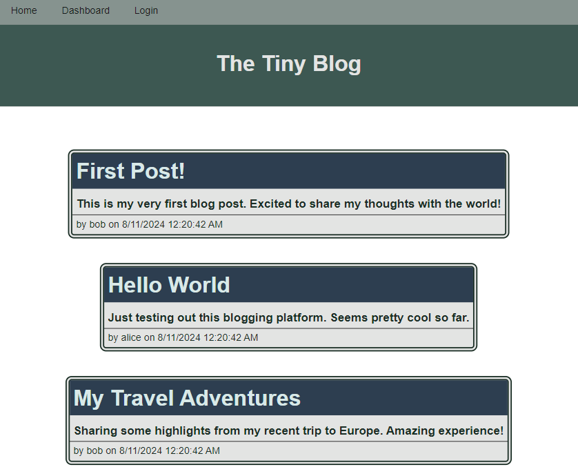

# tiny-blog-mvc-express-handlebars-postgres

***
## Table of content
- tiny-blog-mvc-express-handlebars-postgres
  - [Description](#description)
  - [Demo](#demo)
  - [Installation](#installation)
  - [Usage](#usage)
  - [Tests](#tests)
  - [Contributing](#contributing)
  - [License](#license)
  - [Questions](#Questions)
  - [Screenshot](#Screenshot)
***
## Description
This is a tiny blog that hosts posts and comments.  Everyone can view the posts on it and a logged in user may see the user's own posts, make edits and leave comments on other users' posts.

***
## Demo
- A live tiny blog can be found on https://tiny-blog-x5bz.onrender.com/ Given it's on free tier Render, it takes about 30 secs to respond if the server is in an inactivity state.  Start from the login button at the top, which leads to sign up/ login.

***
## Installation
To run this on a local machine:
- The backend requires npm and Postgres.  
  - [Node.js/npm installation](https://docs.npmjs.com/downloading-and-installing-node-js-and-npm)
  - [Postgres installation](https://www.postgresql.org/download/)
1. Clone the repo: https://github.com/momokokong/tiny-blog-mvc-express-handlebars-postgres
2. In the terminal, move to where the cloned local repo is.
3. `npm install` to install the necessary node modules.
4. Set up the database schema and seeds data: In the terminal go to the folder db/
   - `psql -U postgres` you will need to enter the password for Postgres user postgres. In the Postgres bash:
     - `\i schema.sql` 
     - exit by `\q`
5. Create an `.env` file in the root folder to host environmental variables
   - DB_NAME='blog_db'
   - DB_USER='postgres'
   - DB_PASSWORD= your lovely password here
5. `npm run seed` to seed the database
6. `npm run start` to start the server, which without environmental variable should be listening port 3001. 

***
## Usage
1. Once server is running, go to http://localhost:3001 from a browser and start viewing/posting/commenting. 

***
## Tests
1. Play with home/dashboard/comment/add a post/edit a post.
   
***
## Contributing
Contact me.  Find my information in the [Questions](#Questions) section.

***
## License
This project adopts WTFPL license practices. Check the website for license details: [License: WTFPL](http://www.wtfpl.net/about/)

***
## Questions
[momokokong's GitHub profile.](https://github.com/momokokong)

[Po Shin Huang Linkedin profile](https://www.linkedin.com/in/poshinhuang/)

***
## Screenshot
- Homepage

- Specifc post view without login.  Can leave comment if logged in.

- Login/signup page

- User dashboard to see posts owned by the login user

- Add a post from dashboard

- View owned post and edit post/add comment

